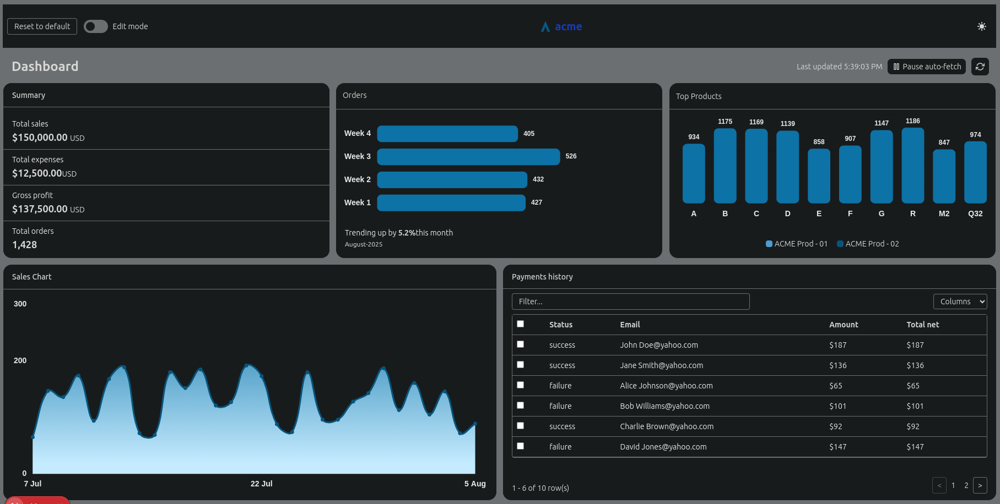
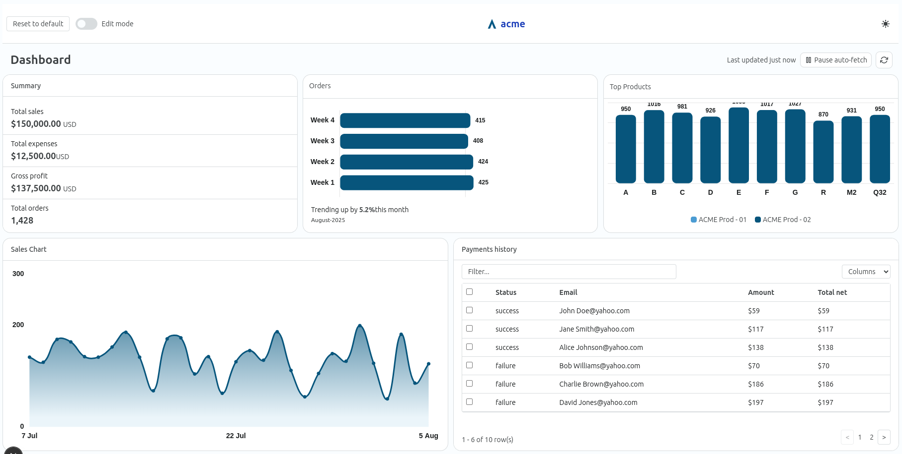

# 🧩 Next.js Dashboard Assignment

A **_responsive, customizable dashboard_** built with **_Next.js 15 (App Router)_**, **_Tailwind CSS v4_**, and **_TypeScript_**. It features a paginated payments table, real-time updates using Faker, theme support, and modular components — all designed for modern frontend workflows.

---

## 🚀 Features

- ✅ **_Next.js 15 App Router_** for routing and layout management
- 🎨 **_Tailwind CSS v4_** with light/dark theme support
- 🛡️ **_TypeScript_** for type-safe component development
- 💳 **_Paginated payments table_** with mock data and checkboxes
- 🔍 **_Filter input_** and **_column selection_** UI
- 🧪 **_Faker.js integration_** for dynamic mock data
- 🌓 **_ThemeLoader_** component for dynamic or server-based themes
- 📱 **_Responsive layout_** using flexible containers
- 🔁 **_Interval-based updates_** to simulate real-time data
- ⚙️ **_Environment-based map/API config_**

---

## 🛠️ Getting Started_

### 1. Clone the repository

```bash
git clone git@github.com:shubham43MP/sales-dashboard.git
cd sales-dashboard
```

### 2. Configure Environment Variables

```bash
cp .env.example .env.local
```

Update `.env.local` with your values:

```env
NEXT_PUBLIC_API_URL=your_api_url_here
NEXT_PUBLIC_API_URL_TOKEN=your_token_here
NEXT_PUBLIC_CENTER_LAT=39.8283
NEXT_PUBLIC_CENTER_LNG=-98.5795
```

_### 3. Install Dependencies_

```bash
npm install
```

### 4. Run the Development Server

```bash
npm run dev
```

Then open your browser at [http://localhost:3000](__http://localhost:3000__)

---

## 📜 Scripts

| Command         | Description                       |
| --------------- | --------------------------------- |
| `npm run dev`   | Starts the development server     |
| `npm run build` | Builds the project for production |
| `npm run start` | Starts the production server      |
| `npm run lint`  | Runs ESLint on the project        |

---

## 🧰 Technologies Used

- [Next.js 15](__https://nextjs.org/__)
- [Tailwind CSS v4](__https://tailwindcss.com/__)
- [TypeScript](__https://www.typescriptlang.org/__)
- [@faker-js/faker](__https://github.com/faker-js/faker__)
- [Chart.js](__https://www.chartjs.org/__)
- [Leaflet](__https://leafletjs.com/__)

---

## 🌟 Possible Enhancements

- Add search and advanced filtering
- Integrate real APIs for payments
- Persist layout or theme using `localStorage`
- Support drag-and-drop dashboard customization
- Dockerize the app for container deployment

---

## 🖼️ Preview




---

🎬 **Watch the [Demo Video](./public/readme-assets/demo-video.mp4)**

---

## 🪪 License

This project is licensed under the [MIT License](__LICENSE__).
